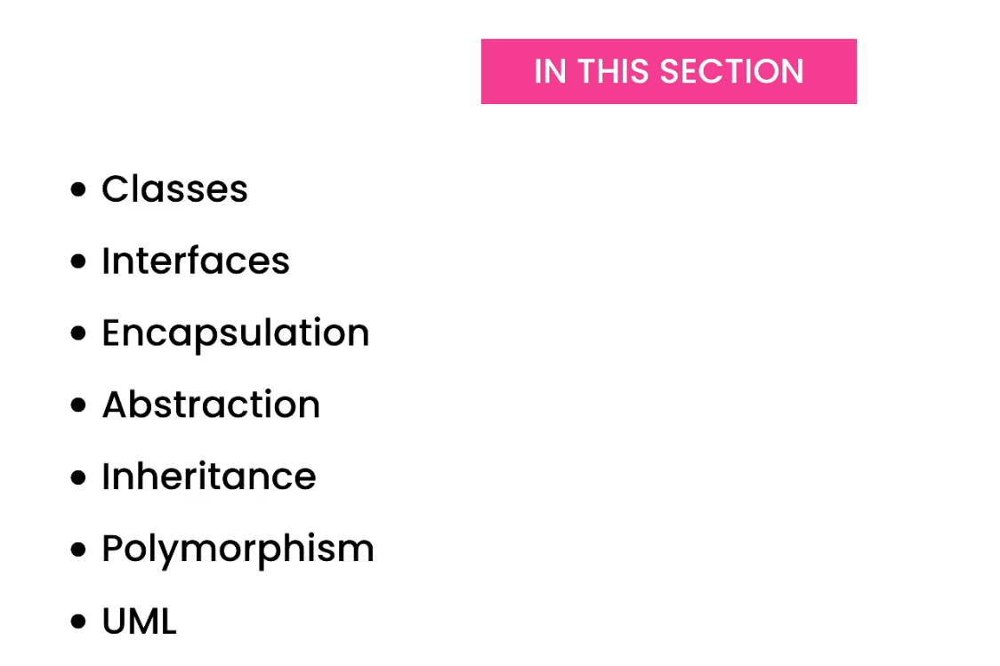
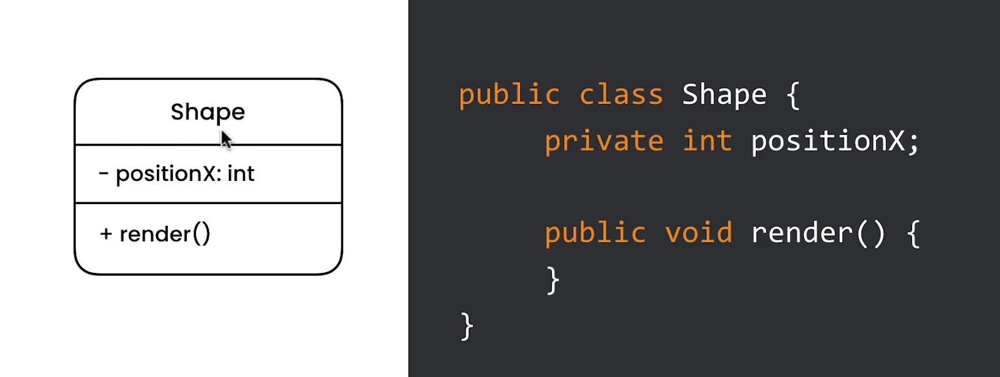
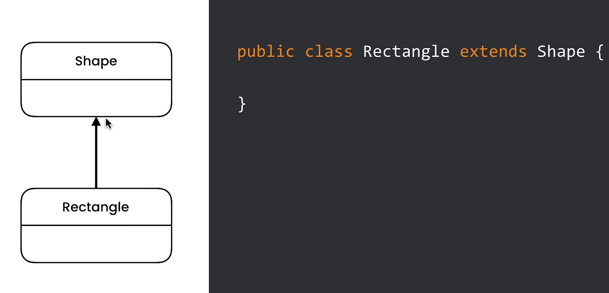
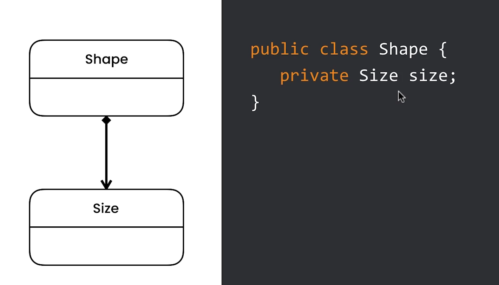
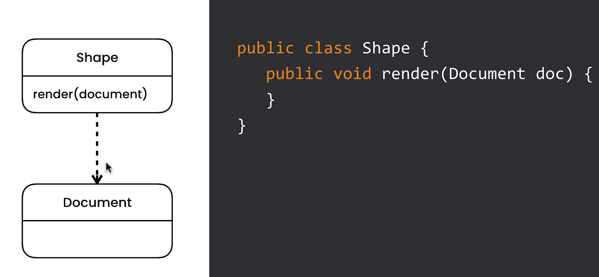
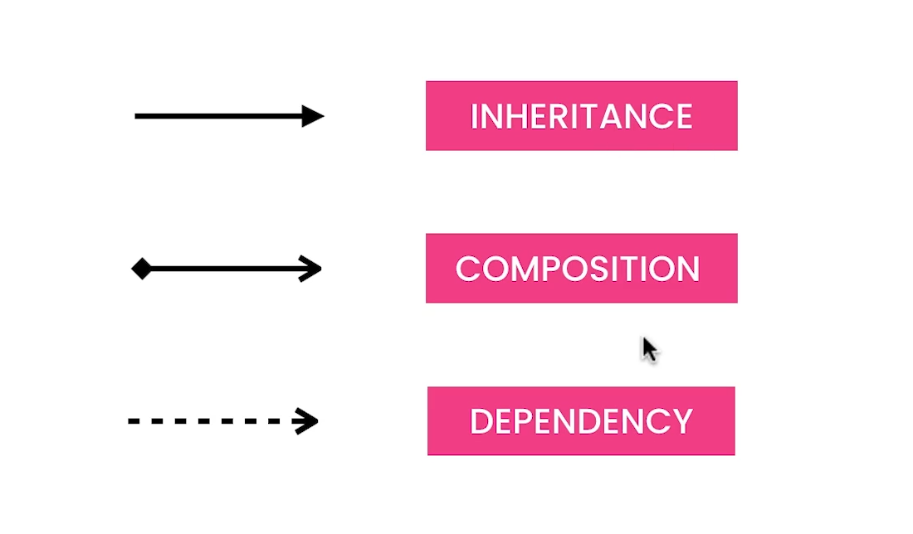

# 3- Memento Pattern

## 1- Introduction

## 2- Getting Started with Java

## 3- Classes

## 4- Coupling

## 5- Interfaces

## 6- Encapsulation

## 7- Abstraction

## 8- Inheritance

## 9- Polymorphism

## 10- UML

